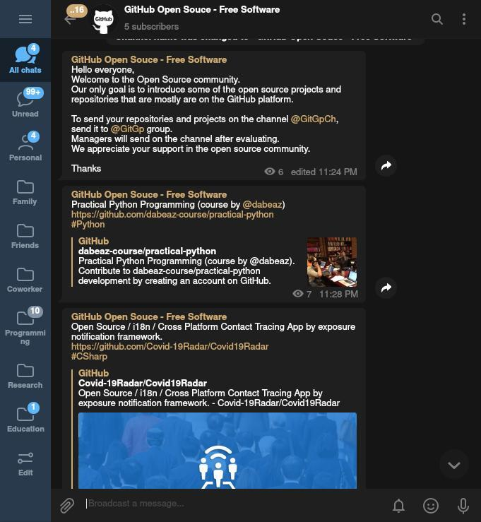

  <a href="https://t.me/GitGpCh" target="_blank">
  
<b>G I T H U B - T R E N D</b>
</a>
  
GitHub Trend, help to find interest and fantastic projects

# telegram-github-trend

A Tiny script to send message for new projects in GitHub Open Source - Free Software/GitHub Trending channel. (https://t.me/GitGpCh)

PHP script to **crawler** and get list of trending repositories in GitHub.

https://t.me/GitGpCh

If you have a significant repository, send the link on Telegram group **@GitGpCh**.

### Depends on

- https://github.com/BaseMax/TinyTelegramBotPHP
- https://github.com/BaseMax/NetPHP

### Similar Projects

- https://github.com/BaseMax/twitter-github-trend

---------

# Max Base

My nickname is Max, Programming language developer, Full-stack programmer. I love computer scientists, researchers, and compilers. ([Max Base](https://maxbase.org/))

## Asrez Team

A team includes some programmer, developer, designer, researcher(s) especially Max Base.

[Asrez Team](https://www.asrez.com/)
